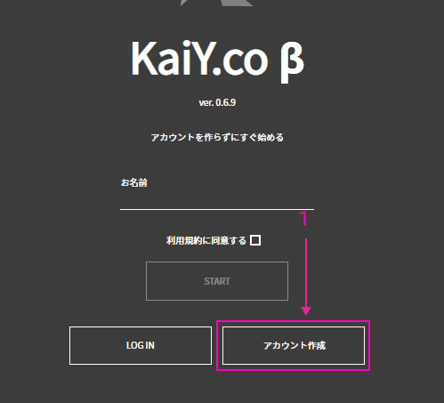

# ヘルプ

## kaiyとは
kaiyとは何なのでしょうか？
kaiyとは「界隈」という意味です。もちろん、「かいわい」と読みます。

## kaiyのビジョン
kaiy のビジョンは、
ボーダレスでハッピーな社会をxtechで実現することです。
人類の幸福にxtechで貢献することが我々の目標です。

ミッションは、なんでもグロースハックしちゃおう！です。
仕事や人生にはいろいろな課題がありますが、それらの課題をなんでもグロースハックして克服しよう！という意味です。

## kaiy.coの概要
kaiy.coとはどのようなサービスなのでしょうか？

kaiy.coとは、Web 3.0時代の新しいマイクロコミュニティサービスです。このサービスでは、友達や同じ会社の人たち、家族と、テレカンファレンスをしながら楽しくおしゃべりをしたり、飲み会をしたり、ライブを見たり、一緒にワイワイとゲームをしたりすることができます。

また、kaiy.coの中に存在する好きなお店での買い物を家にいながらにしてできます。

それでは、kaiy.coにLet's join !

## kaiyのはじめかた
#### ブラウザの設定

#### カメラの設定

#### 対象プラットフォーム
- Windows 10にインストールされた最新版のGoogle Chrome
-  macOSにインストールされた最新版のGoogle Chrome

### ログイン
#### アカウントを作成せずにログイン

1. 赤い矢印で示しているウィンドウに、ニックネームを入力してください。
2. 青い矢印で示しているSTARTボタンを押してください。
3. 1と2の手順を行うと、ロビーへ入れます。

#### アカウントを作成してログイン

1. 赤い矢印で示している「アカウントさくせい」ボタンをクリックしてください。クリックすると、下の画面に移動します。

2. オレンジの矢印で示している名前入力欄に、ニックネームを入力してください。
3. 青い矢印で示しているメールと表示されている欄に、あなたのメールアドレスを入力してください。
4. 黄色の矢印で示している作成ボタンをクリックしてください。すると、ロビーへ入れます。

#### Twitterアカウントでログイン

1.赤い矢印で示している「LOG IN」ボタンをクリックしてください。クリックすると、下の画面が表示されます。

2.オレンジの矢印で示している「Twitterでログイン」ボタンをクリックしてください。クリックすると、下の画面が表示されます。

3.青い矢印で示しているウィンドウに、Twitterでのユーザー名またはTwitterに登録してある電話番号かメールアドレスを入力してください。
4.緑の矢印で示しているウィンドウに、パスワードを入力してください。
5. 3と4が終わったら、紫の矢印で示してあるログインボタンをクリックしてください。クリックすると、ロビーに入れます。

### フロアーへの入場方法
#### ロビー

上の画面がロビーです。

##### フロアー作成

1.赤い矢印で示しているウィンドウに作りたいフロアーの名前を入力してください。
2.オレンジの矢印で示している「つくる」ボタンを押してください。すると、フロアーが作成されます。

##### 高度なフロアー作成

