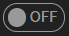
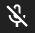
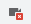

# 通話をする方法

## 1. カメラとマイクを有効にする許可を出す
一番左の窓のをオンにすると、Google Chromeの左上に「kaiy.coが次の許可を求めています マイクを有効にする カメラを有効にする」と表示されているボックスが出てきますので、「許可」と表示されているボタンをクリックしてください。もし「ブロック」と表示されているボタンをクリックしてしまった場合は、「6. もし誤ってカメラとマイクをブロックしてしまった場合は」を参照してください。
## 2. マイクのスイッチをオンにする
と表示されているボタンをクリックするとと表示されます。と表示されている時は、他の人に自分の音声が聞こえている状態です。
## 3. マイクのスイッチをオフにする
と表示されているボタンをクリックするとと表示されます。と表示されている時は、他の人に自分の音声が聞こえていない状態です。
## 4. カメラのスイッチをオンにする
と表示されているボタンをクリックするとと表示されます。と表示されている時は、他の人に自分の顔の映像が見えている状態です。
## 5. カメラのスイッチをオフにする
と表示されているボタンをクリックするとと表示されます。と表示されている時は、他の人に自分の顔の映像が見えている状態です。
## 6. もし誤ってカメラとマイクをブロックしてしまった場合は
URLが表示されているバーの一番右にあるが