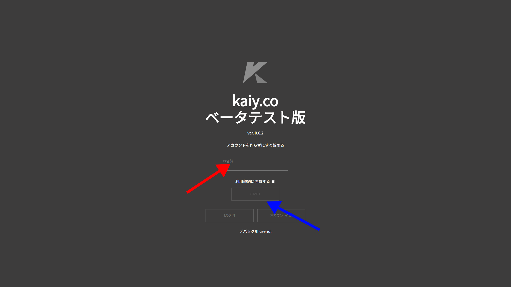
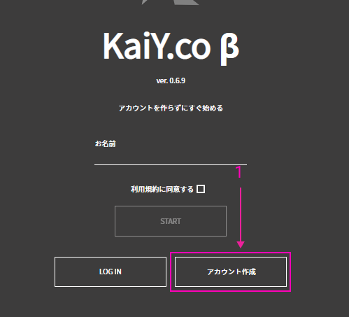
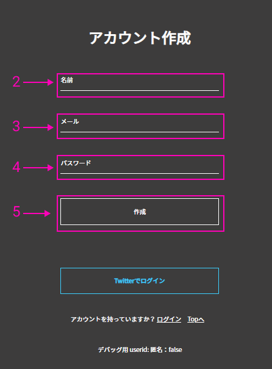
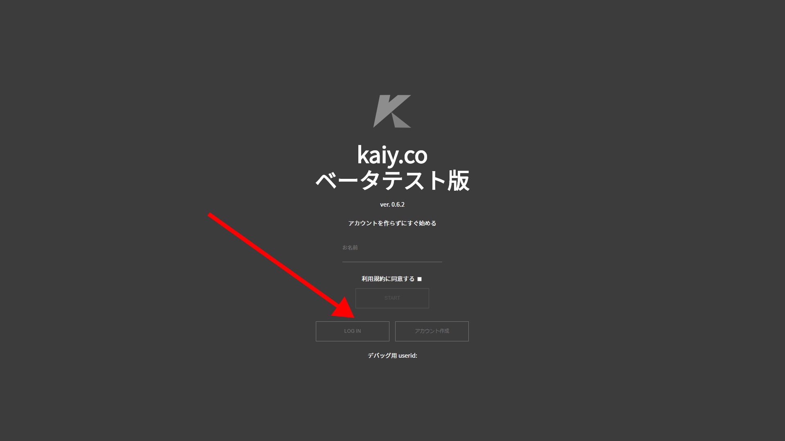
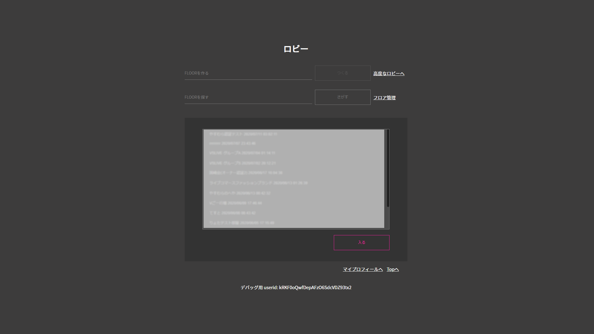
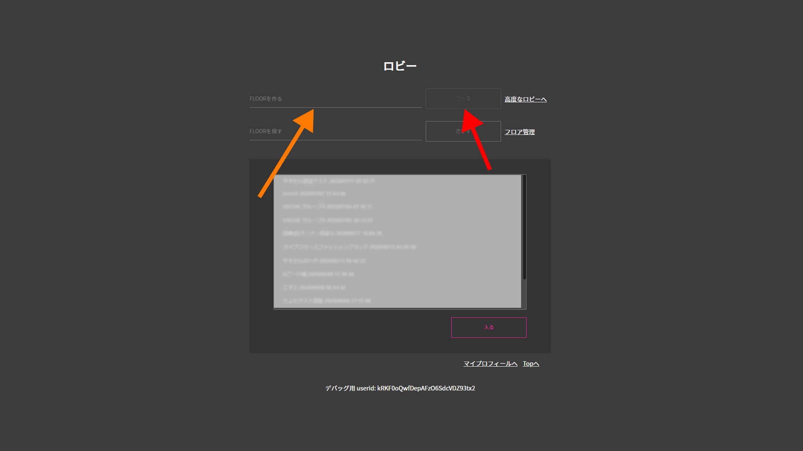

# User Guide

## kaiyのはじめかた

#### ブラウザの設定

#### カメラの設定

#### 対象プラットフォーム
- Windows 10にインストールされた最新版のGoogle Chrome
- macOSにインストールされた最新版のGoogle Chrome

### ログイン
#### アカウントを作成せずにログイン

1. 赤い矢印で示しているウィンドウに、ニックネームを入力してください。
2. 青い矢印で示しているSTARTボタンを押してください。
3. 1と2の手順を行うと、ロビーへ入れます。

#### アカウントを作成してログイン

1. 赤い矢印で示している「アカウントさくせい」ボタンをクリックしてください。クリックすると、下の画面に移動します。

2. オレンジの矢印で示している名前入力欄に、ニックネームを入力してください。
3. 青い矢印で示しているメールと表示されている欄に、あなたのメールアドレスを入力してください。
4. 黄色の矢印で示している作成ボタンをクリックしてください。すると、ロビーへ入れます。

#### Twitterアカウントでログイン

1. 赤い矢印で示している「LOG IN」ボタンをクリックしてください。クリックすると、下の画面が表示されます。

2. オレンジの矢印で示している「Twitterでログイン」ボタンをクリックしてください。クリックすると、下の画面が表示されます。

3. 青い矢印で示しているウィンドウに、Twitterでのユーザー名またはTwitterに登録してある電話番号かメールアドレスを入力してください。
4. 緑の矢印で示しているウィンドウに、パスワードを入力してください。
5. 3と4が終わったら、紫の矢印で示してあるログインボタンをクリックしてください。クリックすると、ロビーに入れます。

### フロアーへの入場方法
#### ロビー

上の画面がロビーです。

##### フロアー作成

1. 赤い矢印で示しているウィンドウに作りたいフロアーの名前を入力してください。
2. オレンジの矢印で示している「つくる」ボタンを押してください。すると、フロアーが作成されます。

##### 高度なフロアー作成