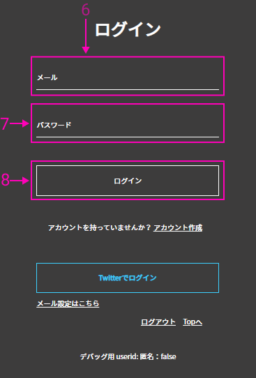
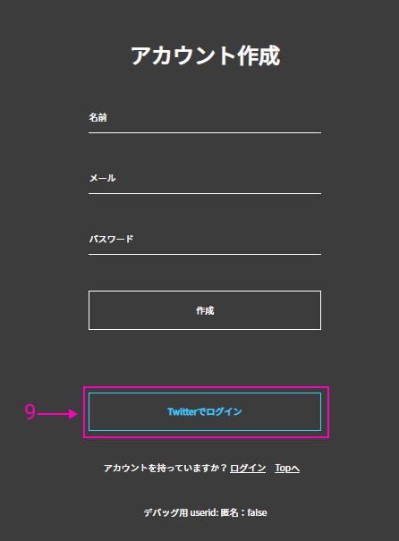
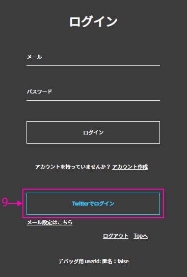

# KaiYのはじめかた
## 1.アカウント作成/ログインする

- アカウントを作成する場合は1～5を、既にアカウントをお持ちの場合は6～8を、Twitterでログインする場合は9~12を参照してください。

1. トップページのアカウント作成ボタンをクリックしてください。

2. お好きなハンドルネームを入力してください。このハンドルネームがKaiYで使われる名前です。
3. お持ちのメールアドレスを入力してください。
4. 任意のパスワードを入力してください。
5. 以上の内容が入力されましたら、作成ボタンをクリックしてください。すると、アカウントが作成されます。

6. 登録したメールアドレスを入力してください。
7. 登録したパスワードを入力してください。
8. 以上の内容が入力されましたら、ログインボタンを押してください。

9. Twitterでログインと描かれているボタンを押してください。
10. お持ちのTwitterアカウントのユーザー名、またはメールアドレスを入力してください。
11. お持ちのTwitterアカウントのパスワードを入力してください。
12. 以上の内容が入力されましたら、ログインボタンを押してください。

